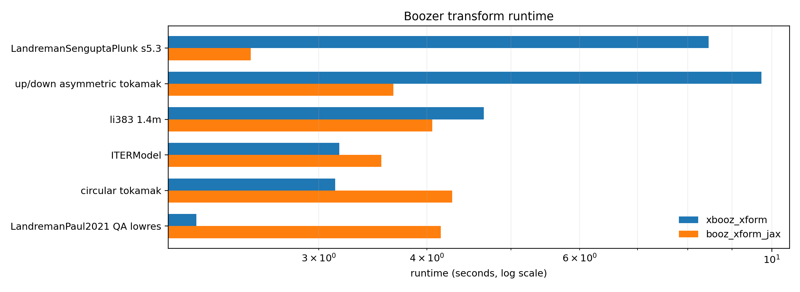
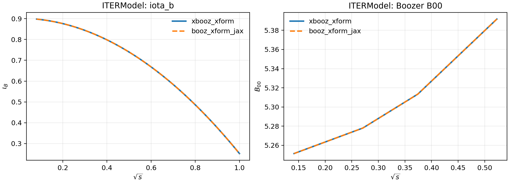
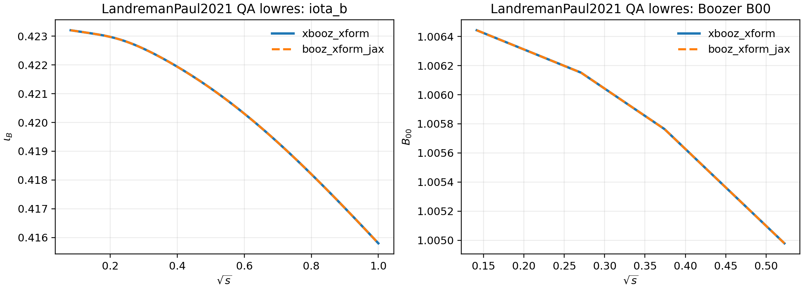
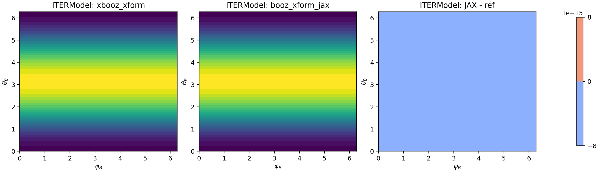
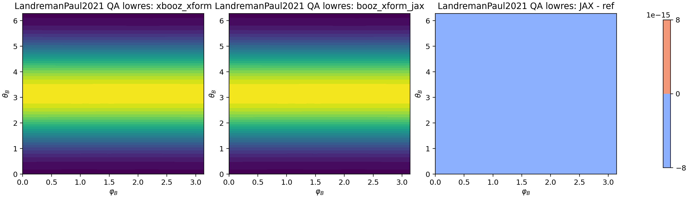

# booz\_xform\_jax

A high-performance, JAX-based reimplementation of the classic **BOOZ\_XFORM** code for transforming VMEC equilibria into **Boozer coordinates** and computing Boozer-space Fourier spectra of the magnetic field strength \|B\| and related geometric quantities.

> **Status:** Research-grade, under active development. Interfaces and internals may change.
>
> This repository aims to be:
> - a **drop-in, differentiable analogue** of the C++/Fortran BOOZ\_XFORM used by `simsopt` and related tools;
> - a **pedagogical reference implementation** showing how the Boozer transform can be expressed in modern array-based, differentiable form.

## Showcase

The figures below compare `booz_xform_jax` with the original C++ `xbooz_xform`
on the same VMEC `wout` inputs. The radial/profile comparisons use
`ITERModel` and `LandremanPaul2021_QA_lowres` when those VMEC reference files
are available locally; the runtime panel includes those cases plus the bundled
BOOZ\_XFORM regression cases.

<p align="center">
  
</p>

<table>
  <tr>
    <td></td>
    <td></td>
  </tr>
  <tr>
    <td align="center"><code>ITERModel</code> Boozer profiles (reference vs JAX)</td>
    <td align="center"><code>LandremanPaul2021_QA_lowres</code> Boozer profiles (reference vs JAX)</td>
  </tr>
  <tr>
    <td></td>
    <td></td>
  </tr>
  <tr>
    <td align="center"><code>ITERModel</code> outer-surface |B| in Boozer angles</td>
    <td align="center"><code>LandremanPaul2021_QA_lowres</code> outer-surface |B| in Boozer angles</td>
  </tr>
</table>

Reproduce these assets with:

```bash
python tools/readme_compare.py
```

---

## 1. Background and motivation

Design and optimisation of stellarators heavily exploit magnetic coordinates adapted to the field lines. Among them, **Boozer coordinates** are particularly important: in Boozer coordinates, the magnetic field takes the form
\[
\mathbf{B} = \nabla \psi \times \nabla \theta_B + \iota(\psi) \nabla \zeta_B \times \nabla \psi,
\]
with simple, nearly straight field lines and a convenient representation of quasisymmetry, quasi-isodynamicity, and omnigenity.

Most optimisation pipelines start from an MHD equilibrium computed by **VMEC** (a spectral code for 3D MHD equilibria). VMEC outputs the equilibrium in a VMEC-specific poloidal/toroidal angle system and in Fourier space. Post-processing codes like **BOOZ\_XFORM** then convert this VMEC representation into Boozer coordinates and compute Fourier spectra of \|B\| and other geometric quantities on flux surfaces.

### 1.1 The original BOOZ\_XFORM lineage

The classical Boozer transform implementation has evolved through several code bases:

1. **FORTRAN BOOZ\_XFORM in STELLOPT**  
   The earliest widely-used implementation lives in the STELLOPT optimisation suite as a FORTRAN code:  
   - Source: <https://github.com/PrincetonUniversity/STELLOPT/tree/develop/BOOZ_XFORM>  
   - Documentation: <https://princetonuniversity.github.io/STELLOPT/BOOZ_XFORM>  

2. **Modernised C++/Python BOOZ\_XFORM (Hidden Symmetries project)**  
   A modern rewrite in C++ with a Python interface is maintained by the **Hidden Symmetries** collaboration:  
   - GitHub: <https://github.com/hiddenSymmetries/booz_xform>  
   - Theory and API docs: <https://hiddensymmetries.github.io/booz_xform/>  

   This version is highly optimised, integrated with VMEC and `simsopt`, and has a rich test suite and documentation describing the theory of the transform and its numerical implementation.

3. **This project: `booz_xform_jax`**  
   The goal here is a **JAX-native** implementation that:
   - keeps the *same physics* and nearly the same numerical algorithm as the C++ version;
   - exposes a **pure-Python**, differentiable interface;
   - can be integrated into **gradient-based optimisation and machine learning loops** (e.g., with JAX, Equinox, Optax).

This repository is not a fork of the C++ implementation but a **from-scratch re-expression** of its algorithm in JAX/NumPy, written to be both high-performance and pedagogically clear.

---

## 2. Key features

- **JAX-native numerical core**
  - All heavy computations use `jax.numpy` and vectorised operations.
  - Minimal Python loops; expensive Fourier sums are expressed as batched `einsum` / matmul-style contractions.
  - Designed so that the main transform can be wrapped in `jax.jit` or `jax.vmap` by the *user*, depending on their workflow.
  - Optional streamed Fourier mode avoids large `N_grid × N_mode` temporaries for memory-constrained runs.

- **Close correspondence to C++ BOOZ\_XFORM**
  - The implementation follows the theory and algorithm described in:
    - Hidden Symmetries BOOZ\_XFORM docs: <https://hiddensymmetries.github.io/booz_xform/theory.html>  
    - Original STELLOPT BOOZ\_XFORM docs: <https://princetonuniversity.github.io/STELLOPT/BOOZ_XFORM>  
  - Mode lists, symmetry conventions, and normalisation factors are chosen to match the reference C++/Fortran behaviour as closely as possible.

- **Differentiable Boozer transform**
  - The core `Booz_xform.run()` method is written in AD-friendly JAX primitives.
  - You can, in principle, differentiate \|B\| and Boozer-space diagnostics with respect to VMEC input data passed in as JAX arrays (e.g., surface-shape Fourier coefficients), enabling:
    - gradient-based stellarator optimisation,
    - embedding the transform into end-to-end differentiable pipelines (e.g., joint equilibrium + Boozer-property optimisation).

- **Pure Python I/O and plotting**
  - `vmec.py`: read VMEC `wout` files and populate the `Booz_xform` instance.
  - `io_utils.py`: read/write `boozmn` files in a NetCDF format compatible with the C++ code where possible.
  - `plots.py`: quick-look diagnostics (surfplot, symplot, modeplot, wireplot) using Matplotlib.

- **Test coverage**
  - Regression tests against reference `wout_*.nc` and/or `boozmn` files.
  - Designed to slot into CI pipelines (e.g., GitHub Actions) for reproducibility.

---

## 3. Algorithm outline

The core physics is the same as in the original BOOZ\_XFORM codes. Very briefly:

1. **Read VMEC equilibrium**  
   VMEC provides Fourier coefficients for R, Z, λ (the poloidal angle shift), and the magnetic field components in VMEC coordinates on a half-grid in the radial coordinate `s`.

2. **Choose Boozer resolution**
   - Set the maximum poloidal and toroidal mode numbers `(mboz, nboz)` for the Boozer harmonics.
   - Build the Boozer mode lists `(m, n)` with the convention:
     - \(m = 0, 1, ..., m_{\text{boz}}-1\)
     - for \(m = 0\): \(n = 0, 1, ..., n_{\text{boz}}\)
     - for \(m > 0\): \(n = -n_{\text{boz}}, ..., 0, ..., n_{\text{boz}}\)

3. **VMEC → real-space fields**  
   For each selected half-grid surface:
   - Synthesize real-space fields R(θ, ζ), Z(θ, ζ), λ(θ, ζ) on a tensor-product grid in VMEC angles (θ, ζ), using the non-Nyquist VMEC Fourier coefficients.
   - Compute derivatives ∂λ/∂θ and ∂λ/∂ζ by acting with m and n factors in Fourier space.

4. **Compute auxiliary function `w` and |B|**  
   Using the Nyquist spectra of the covariant components of B, construct:
   - a scalar `w(θ, ζ)` related to the Boozer poloidal angle shift,
   - the magnetic-field strength \|B(θ, ζ)\|,
   - derivatives ∂w/∂θ and ∂w/∂ζ.

5. **Compute Boozer angles and Jacobian**  
   For each grid point:
   - Evaluate the rotational transform ι(s).
   - Form \(\nu(θ, ζ)\) as in the theory docs, then
     \[
       θ_B = θ + λ + ι \, \nu,\qquad
       ζ_B = ζ + \nu,
     \]
     along with derivatives ∂ν/∂θ, ∂ν/∂ζ.
   - Assemble the Jacobian factor and a geometric factor \(dB/d(\text{vmec})\), following the original algorithm (see the C++ docs for exact equations).

6. **Fourier transform in Boozer angles**  
   - Construct trigonometric tables in Boozer coordinates (cos m θ\_B, sin m θ\_B, cos n ζ\_B, sin n ζ\_B).
   - Perform the integrals over the grid to get:
     - Boozer-space harmonics of \|B\|,
     - Boozer coordinates R(θ\_B, ζ\_B), Z(θ\_B, ζ\_B),
     - Boozer version of the poloidal angle shift ν(θ\_B, ζ\_B),
     - Boozer Jacobian harmonics.

7. **Collect profiles and surface labels**  
   - Extract Boozer I(ψ), G(ψ) from the m=n=0 Nyquist mode.
   - Store the selected surfaces and Boozer spectra on the `Booz_xform` instance for further analysis and plotting.

The JAX implementation keeps this structure but collapses many of the inner loops into high-level array operations and `einsum` contractions, which map efficiently onto CPU or GPU backends.

For further theory and detailed formulae, see:
- Hidden Symmetries BOOZ\_XFORM theory: <https://hiddensymmetries.github.io/booz_xform/theory.html>  
- STELLOPT BOOZ\_XFORM docs: <https://princetonuniversity.github.io/STELLOPT/BOOZ_XFORM>  

---

## 4. Installation

### 4.1 Dependencies

- Python ≥ 3.10
- [JAX](https://github.com/google/jax) and `jaxlib`  
- NumPy
- SciPy (for some I/O or interpolation utilities)
- netCDF4 (optional, recommended for reading/writing NetCDF wout/boozmn files)
- Matplotlib (optional, for plotting)

Typical installation (CPU-only JAX):

```bash
python -m venv .venv
source .venv/bin/activate
pip install --upgrade pip
pip install "jax[cpu]" numpy scipy netCDF4 matplotlib
```

Then install this package in editable/development mode:

```bash
git clone https://github.com/uwplasma/boozx.git
cd boozx
pip install -e .
```

You should now be able to:

```bash
python -c "import booz_xform_jax; print(booz_xform_jax.__version__)"
```

The package also installs legacy-compatible CLI entrypoints:

```bash
xbooz_xform -h
xbooz_xform_jax -h
python -m booz_xform_jax -h
```

---

## 5. Basic usage

### 5.0 Legacy STELLOPT CLI compatibility

This repository now includes a **legacy-compatible terminal driver** that
behaves like STELLOPT's `xbooz_xform`. This is not a toy wrapper. It is meant
to let users take an existing `in_booz.*` file, run `booz_xform_jax` from the
shell, and get the same `boozmn_*.nc` product they would get from the original
Fortran/C++ workflow, while still keeping the JAX-native API available for
end-to-end differentiation and JIT compilation.

Installed entrypoints:

```bash
xbooz_xform
xbooz_xform_jax
python -m booz_xform_jax
```

Legacy invocation:

```bash
xbooz_xform <infile> [T|F]
```

Example:

```bash
xbooz_xform booz_in.li383_1.4m F
```

The accepted `in_booz` format is the same one used by STELLOPT:

```text
32 32
li383_1.4m
2 3 4 25 49
```

What the JAX CLI does, step by step:

1. Reads `mboz` / `nboz` from the first line.
2. Reads the VMEC extension from the second line.
3. Accepts both plain and quoted extensions, for example `MIRFL14_11p` and
   `'MIRFL14_11p'`.
4. Resolves the VMEC file using the same legacy conventions as STELLOPT, e.g.
   `wout_<ext>.nc` or `wout.<ext>.nc`.
5. Reads the optional third-line surface list exactly as a full-grid `jlist`.
6. Applies the same STELLOPT resolution promotion rules:
   `mboz = max(mboz, 2, 6*mpol)` and `nboz = max(nboz, 0, 2*ntor - 1)`.
7. Runs the JAX transform.
8. Writes `boozmn_<extension>.nc` in the current working directory.

Important compatibility detail:

- If the `jlist` line is omitted, `booz_xform_jax` follows the same default
  behavior as legacy `xbooz_xform`: all non-axis surfaces are transformed.

How this is implemented:

- The legacy parser lives in `src/booz_xform_jax/cli.py`.
- The parser converts the `in_booz` file into the same inputs the JAX core API
  expects.
- The CLI then drives the same `Booz_xform` object used by the Python API, so
  the terminal and programmatic paths stay numerically aligned.
- Output is written with the same Boozer NetCDF field names (`bmnc_b`,
  `rmnc_b`, `zmns_b`, `pmns_b`, `gmn_b`, etc.), so downstream tools that
  expect `boozmn` files continue to work.

Comparison with STELLOPT `xbooz_xform`:

| Behavior | STELLOPT `xbooz_xform` | `booz_xform_jax` |
| --- | --- | --- |
| Reads `in_booz.*` | Yes | Yes |
| Accepts `xbooz_xform <infile> [T|F]` | Yes | Yes |
| Resolves `wout_<ext>.nc` / `wout.<ext>.nc` | Yes | Yes |
| Uses full-grid `jlist` semantics | Yes | Yes |
| Promotes `mboz` / `nboz` to legacy minimums | Yes | Yes |
| Writes `boozmn_<ext>.nc` | Yes | Yes |
| JIT / autodiff capable | No | Yes |

How this is tested:

- `tests/test_cli.py` runs the installed JAX CLI against the real reference
  executable from `~/bin/xbooz_xform` (or `BOOZ_XFORM_REFERENCE_BIN`).
- The tests compare generated `boozmn` files directly, field by field.
- Covered cases include bundled examples and additional external VMEC files.
- Current parity coverage includes:
  - `booz_in.li383_1.4m`
  - `booz_in.LandremanSenguptaPlunk_section5p3`
  - `booz_in.up_down_asymmetric_tokamak`
  - `booz_in.circular_tokamak`
  - generated low-resolution QA / stellarator cases from `simsopt`

Observed agreement with STELLOPT:

- For `booz_in.li383_1.4m`, the maximum absolute differences against the
  reference `xbooz_xform` output were:
  - `bmnc_b`: `1.07e-14`
  - `rmnc_b`: `6.66e-15`
  - `zmns_b`: `1.22e-15`
  - `pmns_b`: `2.08e-16`
  - `gmn_b`: `6.11e-15`

This means the CLI is not only syntactically compatible with STELLOPT, but
numerically validated against the reference binary on multiple cases.

### 5.1 From a VMEC `wout` file

The typical workflow mirrors the C++/Python BOOZ\_XFORM API:

```python
from booz_xform_jax.core import Booz_xform

# Create a transform object
bx = Booz_xform()

# Read VMEC wout file (NetCDF)
bx.read_wout("tests/test_files/wout_li383_1.4m.nc", flux=True)

# Optionally, register specific surfaces by index or by s-value
# - indices: 0 .. ns_in-1
bx.register_surfaces([0, 10, 20, 30])
# - or by s in [0,1]:
bx.register_surfaces(0.5)

# Run the Boozer transform
bx.run()

# Optionally save the result to a boozmn file
bx.write_boozmn("outputs/boozmn_li383_1.4m.nc")
```

After `run()`, the object `bx` contains:

- `bx.s_b`: selected surfaces (normalized toroidal flux `s`)
- `bx.xm_b, bx.xn_b`: Boozer (m, n) mode lists
- `bx.bmnc_b, bx.bmns_b`: \|B\| Fourier coefficients in Boozer coordinates
- `bx.rmnc_b, bx.rmns_b`, `bx.zmns_b, bx.zmnc_b`: geometric harmonics for R and Z
- `bx.numns_b, bx.numnc_b`: harmonics of ν
- `bx.gmnc_b, bx.gmns_b`: Boozer Jacobian harmonics
- `bx.Boozer_I, bx.Boozer_G`: Boozer I and G profiles on the selected surfaces

### 5.2 Performance tuning

The JAX API exposes a memory-friendly streamed Fourier mode for the Boozer
spectral reconstruction. Set one of the following environment variables:

- `BOOZ_XFORM_JAX_FOURIER_MODE=streamed`  
  Avoids large `N_grid × N_mode` temporaries by looping over Boozer modes.
  This reduces memory usage at the cost of extra compute.

- `BOOZ_XFORM_JAX_FOURIER_MODE=vectorized` (default)  
  Fastest path, but uses broadcast temporaries that scale with
  `N_grid × N_mode`.

For experimental memory reduction, you can also enable single-precision
trigonometric tables while keeping 64-bit accumulation:

- `BOOZ_XFORM_JAX_TRIG_F32=1`  
  Uses `float32` for trig tables and promotes to `float64` for accumulation.
  This is experimental and may not match reference outputs; validate before use.

### 5.3 Quick-look plots

The `booz_xform_jax.plots` module reproduces some of the classic BOOZ\_XFORM plots.

```python
from booz_xform_jax.core import Booz_xform
from booz_xform_jax import plots

bx = Booz_xform()
bx.read_wout("tests/test_files/wout_li383_1.4m.nc", flux=True)
bx.register_surfaces([0, 10, 20, 30])
bx.run()

# |B| on a given surface in Boozer angles
plots.surfplot(bx, js=0)

# Symmetry plot: B(m,n) vs radius, grouped by symmetry class
plots.symplot(bx, max_m=20, max_n=20)

# Largest Fourier modes as a function of radius
plots.modeplot(bx, nmodes=10)

# 3D wireframe of Boozer-angle field lines on a flux surface
plots.wireplot(bx, js=-1)
```

### 5.4 JAX-native functional API (end-to-end differentiation)

For JIT-native workflows, use the functional API in
`booz_xform_jax.jax_api`. This avoids Python loops over surfaces and
keeps all arrays in JAX.

```python
import jax
import jax.numpy as jnp
from booz_xform_jax import Booz_xform
from booz_xform_jax.jax_api import booz_xform_jax, prepare_booz_xform_constants, booz_xform_jax_impl

bx = Booz_xform()
bx.read_wout("tests/test_files/wout_li383_1.4m.nc")
bx.mboz = 8
bx.nboz = 8

# Prepare JAX arrays with surface dimension first (ns, mn).
rmnc = jnp.asarray(bx.rmnc).T
zmns = jnp.asarray(bx.zmns).T
lmns = jnp.asarray(bx.lmns).T
bmnc = jnp.asarray(bx.bmnc).T
bsubumnc = jnp.asarray(bx.bsubumnc).T
bsubvmnc = jnp.asarray(bx.bsubvmnc).T
iota = jnp.asarray(bx.iota)

# Host-side wrapper:
out = booz_xform_jax(
    rmnc=rmnc,
    zmns=zmns,
    lmns=lmns,
    bmnc=bmnc,
    bsubumnc=bsubumnc,
    bsubvmnc=bsubvmnc,
    iota=iota,
    xm=bx.xm,
    xn=bx.xn,
    xm_nyq=bx.xm_nyq,
    xn_nyq=bx.xn_nyq,
    nfp=bx.nfp,
    mboz=bx.mboz,
    nboz=bx.nboz,
    surface_indices=[0, 5, 10],
)

# JIT-friendly path: precompute constants and jit the core.
constants, grids = prepare_booz_xform_constants(
    nfp=bx.nfp,
    mboz=bx.mboz,
    nboz=bx.nboz,
    asym=bool(bx.asym),
    xm=bx.xm,
    xn=bx.xn,
    xm_nyq=bx.xm_nyq,
    xn_nyq=bx.xn_nyq,
)

booz_fn = jax.jit(booz_xform_jax_impl, static_argnames=("constants",))
out = booz_fn(
    rmnc=rmnc,
    zmns=zmns,
    lmns=lmns,
    bmnc=bmnc,
    bsubumnc=bsubumnc,
    bsubvmnc=bsubvmnc,
    iota=iota,
    xm=jnp.asarray(bx.xm),
    xn=jnp.asarray(bx.xn),
    xm_nyq=jnp.asarray(bx.xm_nyq),
    xn_nyq=jnp.asarray(bx.xn_nyq),
    constants=constants,
    grids=grids,
)
```

### 5.3 Fast-track examples

Fast JAX-native examples live in `examples/`:

- `example_li383_jax_api_fast.py`: JIT Boozer transform with no Python surface loop.
- `example_li383_autodiff_opt.py`: toy autodiff optimization of Boozer |B| harmonics.
- `example_vmec_jax_pipeline.py`: run vmec_jax in-memory and feed the result directly into booz_xform_jax.

If you prefer a class-based API, `Booz_xform.run_jax()` provides the same
JAX-native transform without the Python surface loop and returns a boozmn-like
mapping.

To initialize from an in-memory VMEC object (for example, `vmec_jax.WoutData`),
use `Booz_xform.read_wout_data(wout)` and then call `run_jax()`.

### 5.4 Profiling

Use `tools/profile_jax_api.py` to generate a TensorBoard trace for the
JAX-native path:

```bash
python tools/profile_jax_api.py
```

These examples correspond closely to the documentation and figures in:
- <https://hiddensymmetries.github.io/booz_xform/usage.html>  

---

## 6. JAX, JIT, and autodiff

The `Booz_xform.run()` method is written purely in JAX primitives (`jax.numpy`, `einsum`, etc.), but **the method itself is not jitted by default**. This is deliberate:

- For small or medium problems (e.g. single equilibrium, modest resolution), Python-level overhead is small and JIT compile times can dominate.
- For large or repeated runs (e.g., scanning many equilibria or surfaces), you may want to wrap the core transform in `jax.jit` or `jax.vmap` yourself, tuned to your workflow.

A typical pattern for large-scale or differentiable use-cases:

```python
import jax
from booz_xform_jax.core import Booz_xform

bx = Booz_xform()
bx.read_wout("tests/test_files/wout_li383_1.4m.nc", flux=True)

# Suppose you have a function that:
#   - modifies some JAX arrays on bx (e.g. rmnc, zmns),
#   - calls bx.run(),
#   - returns a scalar diagnostic based on Boozer harmonics.

def objective_from_booz(vmec_coeffs):
    # vmec_coeffs: e.g. flattened Fourier coefficients
    # 1) reshape and assign into bx.rmnc, bx.zmns, etc. (as JAX arrays)
    # 2) call bx.run() (optionally restructured into a pure function)
    # 3) build a scalar from bx.bmnc_b, bx.Boozer_I, ...
    ...
    return loss

grad_objective = jax.grad(objective_from_booz)
```

In practice, for fully end-to-end differentiable workflows, you will often wrap the core transform into a pure function:

```python
@jax.jit
def booz_transform(vmec_data, config):
    # vmec_data: pytree of JAX arrays (rmnc, zmns, etc.)
    # config: static information (nfp, mboz, nboz, grids, mode lists)
    # Returns Boozer-space spectra as JAX arrays.
    ...
    return booz_spectra
```

The current `Booz_xform` class is structured so that this refactoring is straightforward: most heavy math is already in pure JAX.

---

## 7. Examples

An `examples/` directory is provided with small scripts that:

- read VMEC `wout` files from `tests/test_files` (e.g. `wout_li383_1.4m.nc`);
- run the Boozer transform on a few surfaces;
- produce quick-look plots (`surfplot`, `symplot`, `modeplot`, `wireplot`);
- optionally save Boozer spectra to `boozmn` files.

Example usage:

```bash
cd examples
python example_surfplot_li383.py
python example_symplot_li383.py
python example_wireplot_li383.py
python example_vmec_jax_pipeline.py
```

Each script is self-contained and heavily commented to illustrate best practices.

---

## 8. Comparison with C++ and FORTRAN BOOZ\_XFORM

While this project aims to be numerically consistent with the C++ and FORTRAN codes, there are a few differences worth noting:

- **Language and backend**
  - C++/FORTRAN versions use explicit loops and low-level memory management for performance.
  - This JAX version expresses the same algorithm in terms of high-level array operations and lets XLA (via JAX) handle optimisation.

- **Symmetry and indexing**
  - Mode-list conventions (m, n) and radial indexing (`s_in` vs `s_b`) are chosen to match the C++ implementation as closely as possible.
  - The `register_surfaces` method mirrors the original `register` logic: you can pass either indices or continuous s values.

- **I/O formats**
  - `read_wout` and `write_boozmn` are designed to be compatible with the VMEC and BOOZ\_XFORM NetCDF conventions used in the Hidden Symmetries repo where possible, but minor differences may exist.
  - When in doubt, you can compare with the canonical C++ version:
    - <https://github.com/hiddenSymmetries/booz_xform>

- **Differentiability and JIT**
  - The C++ and FORTRAN codes were not designed for algorithmic differentiation.
  - Here, the transform is written to be AD-friendly, making Boozer-based metrics usable inside gradient-based stellarator shape optimisation and ML models.

---

## 9. Testing

To run the test suite:

```bash
pip install -e .[test]
pytest -v
```

The tests typically include:

- Regression tests that compare against reference Boozer spectra for known VMEC equilibria (e.g., `wout_li383_1.4m.nc`).
- I/O round-trip checks (`read_wout → run → write_boozmn → read_boozmn`).
- Unit tests for auxiliary helpers (mode lists, surface registration, etc.).

---

## 10. Contributing

Contributions are welcome! In particular:

- Additional tests and reference cases (e.g., QA/QH/QI stellarators).
- Performance tuning for large-resolution or GPU-heavy workflows.
- Extended plotting and diagnostic tools (e.g., bounce-averaged quantities, quasisymmetry measures).
- Clean, well-documented refactors that preserve numerical behaviour.

If you open a pull request, please:

1. Add or update tests where appropriate.
2. Run `pytest` locally before submitting.
3. Keep docstrings and comments clear, especially for numerically subtle parts of the algorithm.

---

## 11. Citation

If you use this code in scientific work, please consider citing both:

1. The **original BOOZ\_XFORM implementations**:

   - **STELLOPT / FORTRAN BOOZ\_XFORM**  
     Source and docs:  
     - <https://github.com/PrincetonUniversity/STELLOPT/tree/develop/BOOZ_XFORM>  
     - <https://princetonuniversity.github.io/STELLOPT/BOOZ_XFORM>  

   - **Hidden Symmetries C++/Python BOOZ\_XFORM**  
     Source and docs:  
     - <https://github.com/hiddenSymmetries/booz_xform>  
     - <https://hiddensymmetries.github.io/booz_xform/>  

   Please refer to those repositories and docs for the canonical references.

2. This **JAX-based implementation** (`booz_xform_jax`):  
   > R. Jorge and collaborators, *booz\_xform\_jax: a JAX-based, differentiable implementation of the Boozer transform*, (in preparation).  

   A more formal reference (arXiv / journal) will be added once available.

If you build derivative codes on top of this repository, adding your own citation is strongly encouraged, and PRs that link to relevant publications are welcome.

---

## 12. License

Unless otherwise noted in individual files, this project is released under an open-source license (see `LICENSE` in the repository).

Please also respect the licenses and citation requirements of:

- VMEC,
- STELLOPT / BOOZ\_XFORM,
- Hidden Symmetries BOOZ\_XFORM,
- JAX and its dependencies.

---

## 13. Acknowledgements

This work builds conceptually and algorithmically on decades of stellarator optimisation research, including (but not limited to):

- The development of VMEC and BOOZ\_XFORM in the stellarator community.
- The modernisation of BOOZ\_XFORM and associated theory by the Hidden Symmetries collaboration.
- The broader open-source ecosystem around JAX, scientific Python, and stellarator optimisation (e.g., `simsopt`).

We are especially grateful to the authors and maintainers of:

- STELLOPT and its BOOZ\_XFORM module,  
- the C++/Python BOOZ\_XFORM repository at Hidden Symmetries,  
- and the JAX/Core Python scientific stack that makes a clean, differentiable reimplementation possible.
