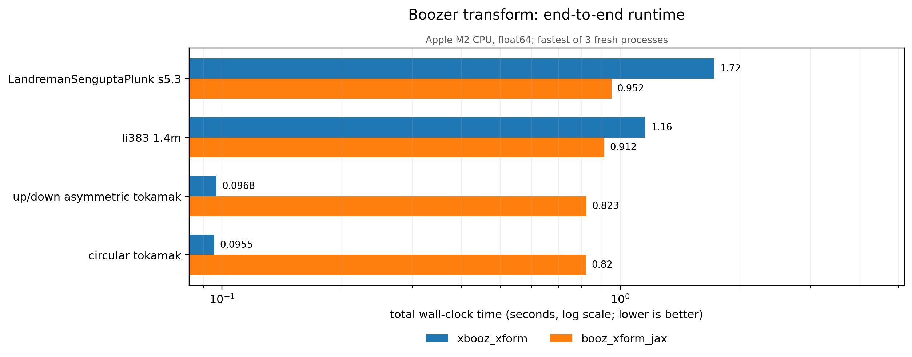

# booz_xform_jax

[](https://pypi.org/project/booz_xform_jax/)
[](https://github.com/uwplasma/booz_xform_jax/actions/workflows/ci.yml)
[](https://pypi.org/project/booz_xform_jax/)
[](LICENSE)

Boozer coordinate transforms for VMEC and VMEX equilibria, with differentiable JAX kernels and legacy BOOZ_XFORM input and output files.

## Installation

```bash
pip install booz_xform_jax
```

For NVIDIA GPUs, install [JAX with CUDA support](https://docs.jax.dev/en/latest/installation.html#nvidia-gpu) in the same environment. For development, use `pip install -e .[dev]` in a clone.

## Quick start

Use a STELLOPT control file with `booz_xform_jax`, `xbooz_xform_jax` or `xbooz_xform`:

```bash
booz_xform_jax in_booz.mycase F
```

```python
from booz_xform_jax import Booz_xform

bx = Booz_xform()
bx.read_wout("wout_mycase.nc", flux=True)
bx.register_surfaces([0.25, 0.5, 0.75])
bx.run()
bx.write_boozmn("boozmn_mycase.nc")
```

Use `bx.run_jax()` or the [functional API](docs/api.rst) for compiled transforms and `jax.grad`, `jax.jvp` and `jax.vmap`. [Examples](docs/examples.rst) cover geometry, resolution scans and optimization.

## Capabilities

| Feature | BOOZ_XFORM (Fortran) | booz_xform_jax |
|---|:---:|:---:|
| CPU | ✅ | ✅ |
| GPU | ❌ | ✅ |
| Automatic differentiation | ❌ | ✅ |
| Stellarator symmetric geometry | ✅ | ✅ |
| Nonstellarator symmetric geometry, including sine spectra | ✅ | ✅ |
| Legacy control files and NetCDF `boozmn` output | ✅ | ✅ |

## Accuracy and speed

Matched CLI transforms agree with STELLOPT BOOZ_XFORM to double precision, including nonzero sine coefficients. Times below include process startup and file I/O: Apple M2 CPU, float64, fastest of three fresh processes, compilation cache disabled.



| Equilibrium | Surfaces | Relative L2 error in cosine and sine spectra | Fortran | JAX |
|---|---:|---:|---:|---:|
| Circular tokamak | 3 | 4.8e-15 | 0.10 s | 0.82 s |
| Up/down asymmetric tokamak | 3 | 1.0e-14 | 0.10 s | 0.82 s |
| li383 | 4 | 4.9e-15 | 1.16 s | 0.91 s |
| Landreman–Sengupta–Plunk | 4 | 5.7e-15 | 1.72 s | 0.95 s |

Fortran is faster on the small tokamak cases; JAX is faster on these stellarator cases. JAX process startup takes 0.71 s; full-process peak memory is 224–514 MiB versus 12–71 MiB for Fortran. [Measurements](README_assets/readme_compare_metrics.json) include resolution and memory; [the memory plot](docs/comparison_memory.png) shows all four cases.

Compiled Python transforms amortize their first-call cost:

| li383, 48 surfaces, `mboz=nboz=16` | First call | Warm call |
|---|---:|---:|
| JAX, x86-64 CPU | 0.446 s | 0.0830 s |
| JAX, RTX A4000 GPU | 0.728 s | 0.00629 s |

These synchronized kernel measurements use JAX 0.9.2 and exclude setup and file I/O. [CPU](profiles/matrix_separable_cpu.json) and [GPU](profiles/matrix_separable_gpu.json) records include derivative timings and source revisions.

Reproduce the CLI comparison with a STELLOPT `xbooz_xform` executable on `PATH`:

```bash
python tools/readme_compare.py --repeats 3
```

## Documentation

[Quickstart](docs/quickstart.rst) · [Theory](docs/theory.rst) · [Inputs and outputs](docs/inputs_outputs.rst) · [Numerics](docs/numerics.rst) · [STELLOPT compatibility](docs/stellopt_compatibility.rst) · [API](docs/api.rst)

## Citation and license

Cite the Boozer-coordinate and BOOZ_XFORM literature in [the bibliography](docs/citations.rst), together with this repository. Licensed under [MIT](LICENSE).
