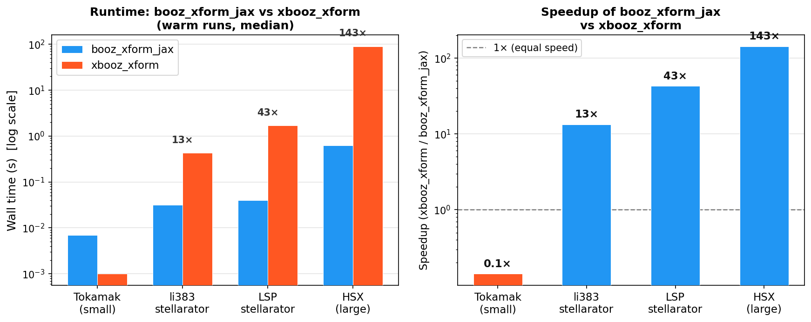
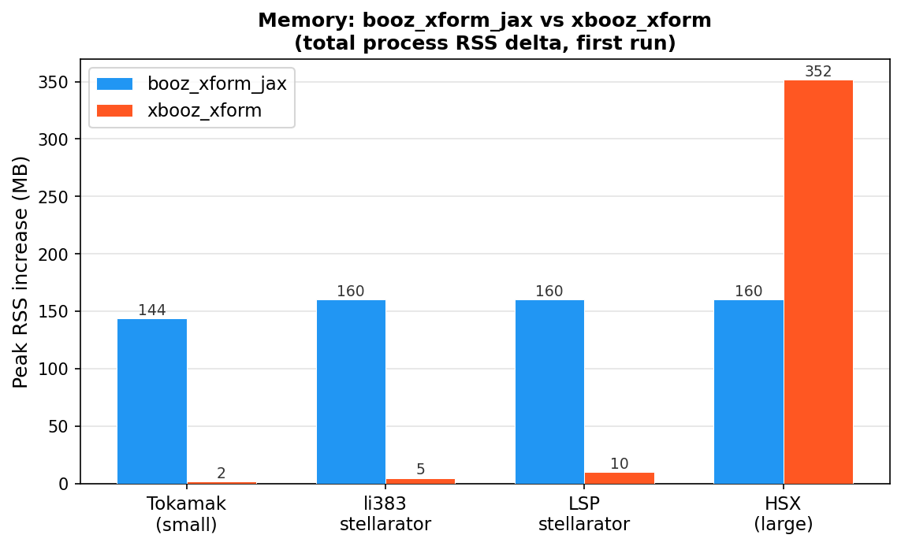

booz_xform_jax
==============

Install from PyPI::

  pip install booz_xform_jax

``booz_xform_jax`` is a pure-Python, JAX-based implementation of the Boozer
coordinate transformation used to post-process VMEC equilibria. The package
keeps the familiar ``xbooz_xform`` workflow for command-line use while also
providing a differentiable Python and JAX API for optimization and analysis
pipelines.

What This Package Covers
------------------------

- VMEC ``wout`` ingestion through :meth:`booz_xform_jax.Booz_xform.read_wout`
  and :meth:`booz_xform_jax.Booz_xform.read_wout_data`.
- STELLOPT-style ``in_booz.*`` command-line execution through
  ``booz_xform_jax``, ``xbooz_xform``, and ``xbooz_xform_jax``.
- Boozer-spectrum computation, ``boozmn`` NetCDF writing, and round-trip file
  reading.
- JAX-native functional transforms for JIT compilation, batching, and
  differentiation.
- Plotting helpers for surfplots, symmetry plots, mode plots, and wireframe
  visualizations.

The documentation below combines project-specific API details with the
established BOOZ_XFORM conventions used in STELLOPT and the modern
HiddenSymmetries implementation.

.. toctree::
   :maxdepth: 2
   :caption: User Guide

   quickstart
   theory
   inputs_outputs
   numerics
   examples
   stellopt_compatibility
   api
   citations
